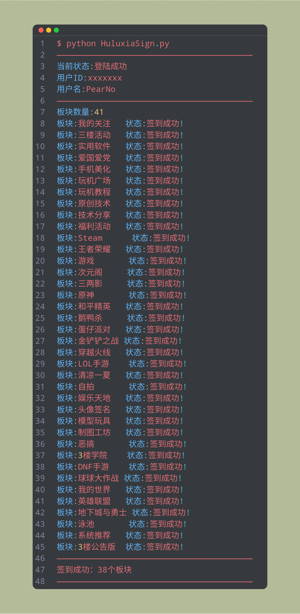

# 🎭 葫芦侠板块签到脚本

这是一个基于 Python 编写的脚本，可以帮助你自动完成葫芦侠论坛中的板块签到任务，省去繁琐的手动操作。

## 功能特点

- 自动登录葫芦侠论坛，自动完成板块签到任务；
- 支持多账号登录，轻松管理多个账号；
- 使用简单，只需要配置好账号信息，即可一键运行脚本；
- 代码开源，可自由修改和定制。

## 使用方法

1. 克隆本项目到本地：

   ```bash
   git clone https://github.com/PearNoDec/HuluxiaSign.git
   ```

2. 安装依赖：

   ```bash
   pip install requests
   ```

3. 修改配置文件：

   打开 `HuluxiaSign.py` 文件，根据注释填写相关信息，包括账号、密码等信息。

4. 运行脚本：

   在命令行中执行以下命令：

   ```bash
   python HuluxiaSign.py
   ```

   执行完毕后，会自动完成签到任务并输出签到结果。

## 注意事项

- 请勿过度使用此脚本，以免造成不必要的麻烦；
- 使用脚本可能会被论坛封禁账号，请自行承担风险；
- 本脚本仅供学习交流使用，请勿用于非法用途。

## 运行结果



## 贡献者

- @PearNoDec

## 许可证

本项目采用 MIT 许可证，详情请见 [LICENSE](./LICENSE) 文件。
